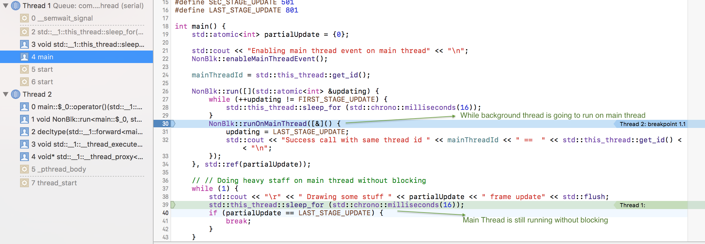

NonBlockpp
==========

NonBlockpp is small c++ library to proceed background task then runOnMainThread(runOnUIThread), all the progress without blocking the main thread running. 

Table of Contents
=================

* [Usage](#usage)
* [What can I use for ?](#what-can-i-use-for-)
* [How it works](#how-it-works)
* [Installation](#installation)
* [Support](#support)


Usage
=====

### First, enable the Main Thread Call back link event in your main thread.
```cpp

NonBlk::enableMainThreadEvent();

```

### Run task as background immediately
```cpp
int partialUpdate=0;
NonBlk::run([](int &updating) {
   // Doing HTTP Calling
   // Doing WebSocket Hook
   // Doing heavy deep file copy
   // etc..
}, std::ref(partialUpdate));
```

### RunOnMainthread from background immediately.
```cpp
int partialUpdate=0;
NonBlk::run([](int &updating) {
   // Doing HTTP Calling
   // Doing WebSocket Hook
   // Doing heavy deep file copy
   // ....
   // Done 
    NonBlk::runOnMainThread([]() {
        std::cout << "Success call with same thread id " << mainThreadId << " ==  " << std::this_thread::get_id() << "\n";
    });
}, std::ref(partialUpdate));
```

### Save task and run all or specific task later.
```cpp
NonBlk::EventId taskEv = NonBlk::pushTask([&]() {
    std::cout << " Do background task " << "\n";
    dispatchMainThreadEv = NonBlk::pushEventToMainThread([&]() {
        std::cout << "\nSuccess call with same thread id " << mainThreadId << " ==  " << std::this_thread::get_id() << "\n";
    });
});

NonBlk::runTask(taskEv);
```

### Save event and run all or specific on main thread later.
```cpp
std::thread::id mainThreadId =  std::this_thread::get_id();
NonBlk::EventId ev;
NonBlk::run([&]() {
   ev = NonBlk::pushEventToMainThread([&]() {
        EXPECT_TRUE( std::this_thread::get_id() == mainThreadId ) << " It is not main thread!! " << std::this_thread::get_id() << " == " << mainThreadId << "\n";
    });
});

std::thread([&](){
    std::this_thread::sleep_for (std::chrono::milliseconds(500));
    NonBlk::runEventOnMainThread(ev);
}).detach();
```

### Or you can mix any of these above, the api above all are ** NON BLOCKING YOUR MAIN THREAD ** 


What can I use for ?
====================

- For stress test framework such as CONCURRENT TEST, async sync test, replication test, clustering test.

- For your c/c++ or other mobile games( running on background and back to UI thread)

- For creating multiple service hooker in one process worker, such as websocket, tcp listener, udp listener and etc.


How it works
============




Installation
============
```console
cd to nonblockpp project root path
mkdir build
cd build/
cmake ..
make
./unit_tests 
make install
```

or
```console
sudo make install
```

## Android Build
```console
cd to nonblock-android
./build.sh

```

and copy the library to your project.


Support
=======

> Enjoy and use it safe, any suggestions or query please raise a issue and I will discuss with you as much as I can.
